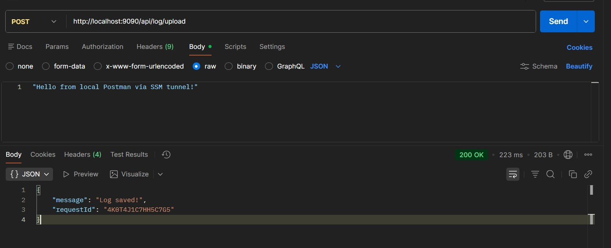
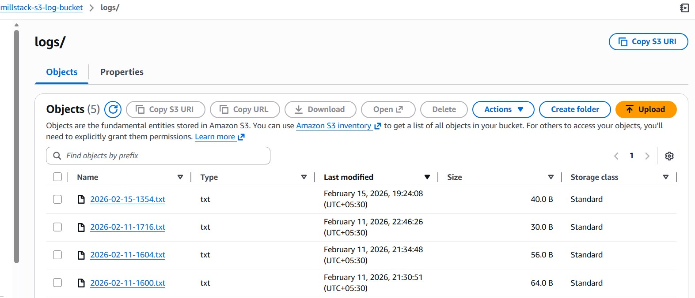
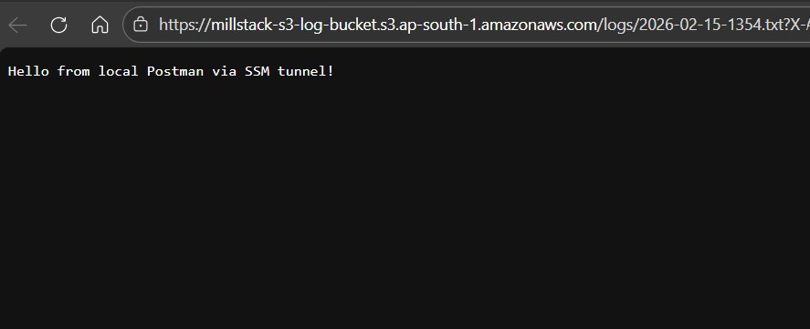

# 🚀 Secure Private-Network API Architecture

A production-grade AWS infrastructure demonstrating a `Zero-Ingress` approach to hosting a `.NET Core Web API`. 
This project showcases how to host applications in a `Private Subnet` (no public IP) and securely manage using 
`AWS Systems Manager` (SSM) tunnels instead of traditional (and less secure) `Bastion` Hosts or `SSH` keys.

<br>

## 🏗️ Architecture Overview

* **VPC**: Custom Virtual Private Cloud with Public and Private subnets
* **Networking**:
  - **NAT Gateway**: Hosted in the Public Subnet to provide private EC2 instances with outbound internet access for updates and provisioning
  - **S3 Gateway Endpoint**: Enables private, cost-free traffic between the EC2 and S3, bypassing the NAT Gateway for logging operations
* **Compute**: .NET 9 Web API hosted on an Ubuntu EC2 instance in a Private Subnet
* **Security**: Zero-Ingress: Security Group has 0 inbound rules. All management is handled via the SSM Agent
  - **Least Privilege**: Separate IAM policies for the User (CLI access) and the Role (Service-to-Service access)

<br>

## 🛡️ Security Groups Configuration

### 1. Public Security Group (Management & Ingress)
* Applied to the NAT Gateway or Public Instances
* **Inbound Rules**:
- **`SSH`** (22): Allowed for initial setup or administrative tasks
- **`HTTP`** (80): Standard web traffic entry point
* **Outbound Rules**:
  - All Traffic: Permitted to allow the NAT Gateway to forward requests to the internet

### 2. Private Security Group (Zero-Ingress)
* Applied to the .NET API EC2 Instance
* **Inbound Rules**:
  - None: This instance is completely shielded from the internet. No public IP and no open ports
* **Outbound Rules**:
  - **`HTTPS`** (443): Required for the SSM Agent to "call home" to AWS Systems Manager and for the .NET API to reach S3/external APIs securely

<br>

## 🔐 IAM Configuration

To achieve this setup, specific granular permissions were implemented to follow the Principle of `Least Privilege`

1. **Local IAM User Policy**
   * Grants your local machine the ability to "bridge" into the private VPC
   * Managed Policy: `AmazonEC2FullAccess`
   * Custom Inline Policy:
     ```json
      {
      	"Version": "2012-10-17",
      	"Statement": [
      		{
      			"Sid": "AllowSSMConnectionAndPortForwarding",
      			"Effect": "Allow",
      			"Action": "ssm:StartSession",
      			"Resource": [
      				"arn:aws:ec2:ap-south-1:ACCOUNT_ID:instance/i-EC2_INSTANCE_ID",
      				"arn:aws:ssm:*:*:document/AWS-StartPortForwardingSession",
      				"arn:aws:ssm:*:*:document/AWS-StartSSHSession"
      			]
      		},
      		{
      			"Sid": "AllowUserToCleanUpTheirOwnSessions",
      			"Effect": "Allow",
      			"Action": [
      				"ssm:TerminateSession",
      				"ssm:ResumeSession"
      			],
      			"Resource": [
      				"arn:aws:ssm:*:*:session/millstack-*"
      			]
      		}
      	]
      }
     ```
3. **EC2 IAM Role**
  * Grants the application permission to write logs without needing hardcoded credentials
  * Managed Policy: `AmazonSSMManagedInstanceCore`
  * Custom Inline Policy:
    ```json
    {
    	"Version": "2012-10-17",
    	"Statement": [
    		{
    			"Sid": "AllowS3ObjectManagement",
    			"Effect": "Allow",
    			"Action": [
    				"s3:PutObject",
    				"s3:DeleteObject",
    				"s3:GetObject"
    			],
    			"Resource": [
    				"arn:aws:s3:::millstack-s3-log-bucket",
    				"arn:aws:s3:::millstack-s3-log-bucket/*"
    			]
    		}
    	]
    }
    ```

<br>

## 🛠️ Step-by-Step User Guide

### 1. Prerequisites
* Install the `AWS CLI`
* Install the `SSM Session Manager Plugin` on your local Windows/Linux machine
* Download and install `.Net X` runtime on ec2
* Deploy the `.NET API` to your private EC2 (via S3 or `SCP-over-SSM`)

### 2. Deploy .Net Web API project to private EC2 instance
* using scp over SSM command
  ```bash

  # for linix-bash : \
  # for windows command prompt: ^
  # for windows powershell: `
  
  scp -i key-File-Name.pem -o ^
    "ProxyCommand=aws ssm start-session ^
    --target i-EC2_INSTANCE_ID ^
    --document-name AWS-StartSSHSession ^
    --parameters portNumber=%p" ^
    -r ./log-ec2-publish ubuntu@i-EC2_INSTANCE_ID:/home/ubuntu/millstack-webapi
  ```

### 3. Start the .NET API
Connect to your instance via the SSM Browser Terminal and run:
```bash
dotnet millstack-ec2.dll --urls "http://*:7080;"
```

### 4. Creating the Secure SSM Tunnel
Open a terminal on your local machine and run the following command to map your local port eg: `9090` to the EC2's port `7080` (running API port)
```bash
aws ssm start-session ^
    --target i-EC2_INSTANCE_ID ^
    --document-name AWS-StartPortForwardingSession ^
    --parameters "{\"portNumber\":[\"7080\"],\"localPortNumber\":[\"9090\"]}"
```

### 5. Hit the Endpoint via Postman
Now that the tunnel is "Waiting for connections," open Postman and send a request:
* **Method**: `POST`
* **URL**: `http://localhost:9090/api/log/upload` (as per API endpoint)
* **Body**: `Raw JSON` payload



### 6. 🧪 Debugging & Validation
* **Checking API Logs**: Observe the EC2 terminal; you should see the request being processed in real-time
* **Verify S3 Creation**: Navigate to the S3 console to see the generated .txt log file in your bucket



<br>

## ⚠️ Cost Optimization
* **Provisioning**: The `NAT Gateway` and `Elastic IP` were utilized only during the setup phase to download the
  `.NET 9 runtime` and critical `OS updates`
* **Verification**: The `SSM Port Forwarding` tunnel was used to securely bridge a local Postman client to the private API for testing.
  This required an active outbound path (NAT) for the SSM Agent to maintain its connection with AWS
* **Production State**: To eliminate hourly costs, the NAT Gateway was deleted post-provisioning.
  The application continues to function by utilizing the free S3 Gateway Endpoint, 
  which allows the logging API to communicate with S3 privately without requiring a NAT Gateway


